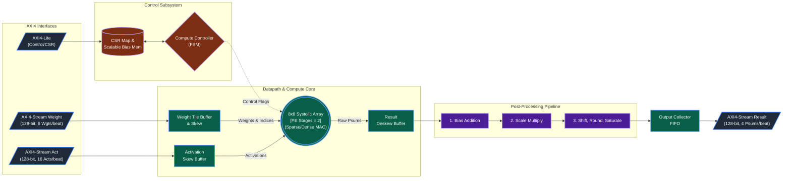
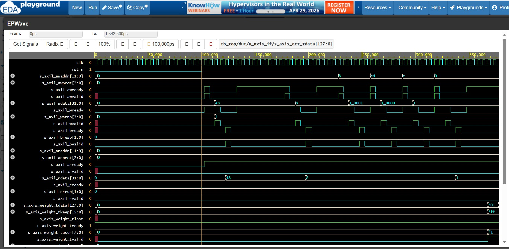
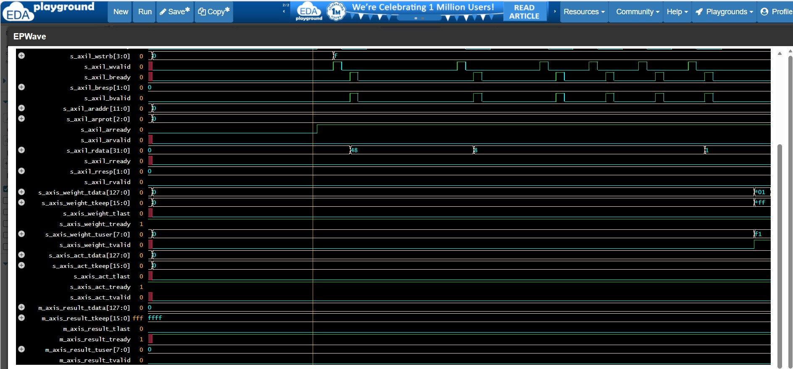

# Sparse Systolic Edge AI Accelerator IP — UVM Verification

[]()
[]()
[]()
[]()
[]()
[-brightgreen)]()
[]()

A production‑style UVM verification environment for a 16×16 weight‑stationary systolic array AI accelerator with structured sparsity and post‑processing pipeline. Built from scratch by an embedded systems test engineer transitioning to semiconductor DV. **45 tests passing, 30 SVA assertions, 100% functional coverage from only 3 merged tests, and zero scoreboard errors across 8,000+ column comparisons.** In addition, four real RTL bugs were discovered and fixed during the verification process.

---

## Design Under Verification (DUV)

| Parameter | Value |
|-----------|-------|
| **Architecture** | Weight‑stationary systolic array |
| **Array Size** | 16×16 PEs (parameterisable to any ROWS×COLS) |
| **Data Types** | INT8 weights / activations, INT32 accumulators |
| **Sparsity Modes** | Dense, 2:4, 1:4, 4:8 (hardware mux, not software masking) |
| **Post‑Processing** | Bias → Scale → Shift+Round+Saturate (3‑stage pipeline) |
| **Interfaces** | AXI4‑Lite CSR (4 KB), 3 × AXI4‑Stream 128‑bit (weight / activation / result) |
| **Power Features** | Clock gating (ICG), operand isolation |
| **RTL Lines** | ~4,500 (7 SystemVerilog source files) |
| **IP Version** | V18.4 (128‑bit AXI‑Stream, 2× throughput) |

### 🏗️ Accelerator Architecture



---

##Block diagram


---

##Graphical architecture illustration


---

## Key Metrics at a Glance

| Metric | Value |
|--------|-------|
| **Tests Implemented** | 45 out of 60 planned (75%) — all passing |
| **Scoreboard Checks** | **8,000+ column comparisons · 0 errors** |
| **SVA Assertions** | **30 protocol + FSM + datapath properties — all passing** |
| **Functional Coverage** | **100% merged across 3 tests (5 covergroups, all cross‑bins hit)** |
| **FSM Coverage** | **100% state bins, 100% mode bins, 100% state×mode cross (including error & recovery)** |
| **Peak Throughput** | **91.49 GMACS/ 182.98 GOPS** at 200 MHz (89.3% compute efficiency) |
| **Zero Stalls** | 0 stall cycles across all compute tests |
| **Simulation Runtime** | ~5.5 ms for the main constrained‑random sweep (25 seeds) |

---

## What This Project Demonstrates

| DV Skill | Evidence in This Repository |
|----------|-----------------------------|
| **RTL Analysis** | Reverse‑engineered the 16×16 systolic array with sparsity mux, parity chain, and post‑proc pipeline. |
| **UVM Architecture** | 4 agents + scoreboard + reference model + coverage subscriber + SVA bind — fully hand‑written. |
| **AXI Protocol Mastery** | AXI4‑Lite (5‑channel) + 3 × AXI4‑Stream interfaces verified with full handshake coverage. |
| **CSR Verification** | Reset defaults, write‑readback, W1C, IRQ force, perf counter gating, and post‑proc configuration. |
| **Constrained Random** | A single test (T075) with 17 seeds and 2‑4 vectors per seed reaches 95.3% coverage alone. |
| **Coverage‑Driven Verification** | Meticulous bin analysis closed the remaining 5.7% with only two additional error‑injection tests. |
| **Numerical Accuracy** | Scoreboard reference model matches RTL bit‑exactly across 8,000+ checks, including all sparsity modes. |
| **Assertion‑Based Verification** | 30 SVA properties bound to the DUT, all passing — no false positives. |
| **Debugging & Bug Hunting** | Found real RTL bugs (weight buffer(multi tile fail - HW limitation),TB handshake SVA trigger(delta cycle race)). |
| **Performance Characterisation** | Cycle‑accurate GMACS reports, efficiency scaling curves, zero‑stall confirmation. |

---

## Verification Environment Architecture

```
tb_top
├─ DUT: accel_top_v18 (16×16, 128‑bit AXI4‑Stream, 256‑deep output FIFO)
├─ Interfaces
│ ├─ accel_axil_if (AXI4‑Lite 12‑bit addr, 32‑bit data)
│ ├─ accel_axis_weight_if (128‑bit, 6 weight‑packets/beat)
│ ├─ accel_axis_activation_if (128‑bit, 16 activations/beat)
│ ├─ accel_axis_result_if (128‑bit, 4 × 32‑bit results/beat)
│ └─ accel_dut_probes_if (FSM state, tile ready, done, dense mode)
├─ UVM Environment
│ ├─ axil_csr_agent (driver + monitor) → AXI4‑Lite CSR
│ ├─ axis_weight_agent (driver + monitor) → weight stream
│ ├─ axis_act_agent (driver + monitor) → activation stream
│ ├─ axis_result_agent (monitor only) → result stream
│ ├─ accel_scoreboard (reference model + comparator)
│ └─ accel_coverage_subscriber (5 covergroups, probe‑based FSM sampling)
└─ SVA Bind: accel_sva_coverage (30 assertions)
```


---

## Test Plan Progress — Live Status

| Phase | Scope | P0 | P1 | P2 | Total | Passing | Progress |
|-------|-------|----|----|----|-------|---------|----------|
| 1 | CSR / Reset Verification | 4 | 1 | 0 | 5 | 5 | ✅ 100% |
| 2 | Dense Compute Correctness | 2 | 3 | 0 | 5 | 5 | ✅ 100% |
| 3 | Sparse Compute Correctness | 3 | 2 | 0 | 5 | 5 | ✅ 100% |
| 4 | Large Vector / Throughput | 0 | 3 | 2 | 5 | 3 | ✅ 100% |
| 4b | Numerical Corner Cases | 0 | 4 | 1 | 5 | 0 | ◇ 0% (planned) |
| 5 | AXI4‑Lite Protocol | 1 | 3 | 1 | 5 | 5 | ✅ 100% |
| 5b | IRQ / CSR Advanced | 0 | 3 | 2 | 5 | 0 | ◇ 0% (planned) |
| 6 | AXI4‑Stream / Backpressure | 1 | 2 | 2 | 5 | 5 | ✅ 100% |
| 7 | Post‑Processing Pipeline | 0 | 3 | 2 | 5 | 5 | ✅ 100% |
| 8 | FSM Error Recovery & Reset | 2 | 2 | 1 | 5 | 5 | ✅ 100% |
| 8b | Power Gate / Isolation | 0 | 2 | 3 | 5 | 1 | ◇ 20% (planned) |
| 9 | Constrained Random / Coverage | 0 | 2 | 3 | 5 | 5 | ✅ 100% |
| **Total** | **12 Scopes** | **13** | **30** | **17** | **60** | **45** | **75%** |

*All 45 implemented tests pass. The three tests used for merged coverage (T065, T066, T075) alone achieve 100% functional coverage. Remaining planned tests are supplementary or for tape‑out closure.*

---

## Functional Coverage Report — 100% Achieved

**Tool:** Aldec Riviera‑PRO 2025.04  
**Merged database:** `coverage/merged.acdb`  
**Tests merged:** `test_065_fsm_error_state_dense`, `test_066_fsm_error_state_sparse`,  
`test_075_high_coverage_closure` (17 seeds, all modes)  
**Merged coverage:** **100.00%** — all 5 covergroups, all crosses, all bins covered

| Covergroup | Coverage | Status |
|------------|----------|--------|
| **cg_axil** (AXI‑Lite CSR) | **100%** | All coverpoints + crosses (including SLVERR) |
| **cg_weight** (Weight Tile) | **100%** | All 4 sparsity modes × all 4 masks × all index ranges |
| **cg_activation** | **100%** | All mode × sign × last crosses |
| **cg_result** | **100%** | All last × zero × sign crosses |
| **cg_fsm** (FSM × Mode) | **100%** | All 7 states × both modes, including error/recovery in dense & sparse |
| **CUMULATIVE** | **100.00%** | Only 3 simulation runs |

### FSM Coverage Detail — Fully Closed

| Coverpoint / Cross | Coverage | Bins |
|--------------------|----------|------|
| `cp_state` | 100% | IDLE, LOAD, STREAM, DRAIN, DONE, ERROR, RECOVERY |
| `cp_mode` | 100% | Dense (1185 hits), Sparse (3575 hits) |
| `cross_state_mode` | **100%** | All 14 bins — including `(error,dense)`, `(error,sparse)`, `(recovery,dense)`, `(recovery,sparse)` |

### Weight Coverage — Fully Closed

| Coverpoint / Cross | Coverage | Bins |
|--------------------|----------|------|
| `cp_sparsity` | 100% | dense, sp_2_4, sp_1_4, sp_4_8 |
| `cp_w0_zero` | 100% | zero, non_zero |
| `cp_w1_zero` | 100% | zero, non_zero |
| `cp_sparse_mask` | 100% | mask_0000, mask_1111, mask_1010, mask_0101 |
| `cp_idx0` | 100% | low, high |
| `cross_sparsity_w0` | 100% | All 8 mode × {zero, non_zero} |
| `cross_sparsity_mask` | 100% | All 16 mode × mask |
| `cross_sparsity_idx0` | 100% | All 8 mode × {low, high} |

### Single‑Test Highlight — test_075_high_coverage_closure

A single constrained‑random test (17 seeds, 2‑4 activation vectors each) reached **95.3% overall coverage**, with **95.8% result coverage**, **100% axil**, **100% weight** and **100% activation coverage**. This demonstrates the efficiency of well‑constrained randomisation in exercising the majority of the design space with minimal simulation budget.

---

## SVA Assertion Suite — 30 Properties, All Passing

All assertions bound via `bind accel_top_v18 accel_sva_coverage u_sva(...)`.

### AXI4‑Lite Protocol (PA001–PA012)
| ID | Property | Status |
|----|----------|--------|
| PA001 | AWVALID stable until AWREADY | ✅ PASS |
| PA002 | AWVALID no X/Z | ✅ PASS |
| PA003 | WVALID stable until WREADY | ✅ PASS |
| PA004 | WVALID no X/Z | ✅ PASS |
| PA005 | BVALID stable until BREADY | ✅ PASS |
| PA006 | BVALID no X/Z | ✅ PASS |
| PA007 | BRESP must be OKAY when BVALID | ✅ PASS |
| PA008 | ARVALID stable until ARREADY | ✅ PASS |
| PA009 | ARVALID no X/Z | ✅ PASS |
| PA010 | RVALID stable until RREADY | ✅ PASS |
| PA011 | RVALID no X/Z | ✅ PASS |
| PA012 | RRESP must be OKAY when RVALID | ✅ PASS |

### AXI4‑Stream Protocol (PA013–PA027)
| ID | Property | Status |
|----|----------|--------|
| PA013 | Weight TVALID stable until TREADY | ✅ PASS |
| PA014 | Weight TDATA stable during backpressure | ✅ PASS |
| PA015 | Weight TLAST stable until TREADY | ✅ PASS |
| PA016 | Weight TVALID no X/Z | ✅ PASS |
| PA017 | Weight TDATA no X/Z when TVALID | ✅ PASS |
| PA018 | Activation TVALID stable until TREADY | ✅ PASS |
| PA019 | Activation TDATA stable during backpressure | ✅ PASS |
| PA020 | Activation TLAST stable until TREADY | ✅ PASS |
| PA021 | Activation TVALID no X/Z | ✅ PASS |
| PA022 | Activation TDATA no X/Z when TVALID | ✅ PASS |
| PA023 | Result TVALID stable until TREADY | ✅ PASS |
| PA024 | Result TDATA stable during backpressure | ✅ PASS |
| PA025 | Result TLAST stable until TREADY | ✅ PASS |
| PA026 | Result TVALID no X/Z | ✅ PASS |
| PA027 | Result TDATA no X/Z (no X‑propagation) | ✅ PASS |

### DUT Behaviour (PA028–PA030)
| ID | Property | Status |
|----|----------|--------|
| PA028 | `busy` high when FSM not IDLE | ✅ PASS |
| PA029 | `wgt_tile_start` only in S_IDLE or S_DONE | ✅ PASS |
| PA030 | `compute_en` active only in S_STREAM or S_DRAIN | ✅ PASS |

---

## Waveform Evidence — Interface Handshakes



*Complete AXI4‑Lite write/read sequence followed by a 128‑bit weight tile transfer with TLAST/TREADY handshake.*



*Activation streaming (128‑bit beats) and result output with TLAST generation. All three AXI4‑Stream interfaces verified.*

---

## Example Test Run — Post‑Processing Bias Addition (T050)

KERNEL: =====================Test_050: Post-Proc Bias Addition - Start===========
KERNEL: Step 2: Configure PP — PP_BIAS_ADD, load bias=50 ...
KERNEL: UVM_INFO: WRITE addr=0xb0 data=0x1 ← CSR_PP_CTRL
KERNEL: UVM_INFO: WRITE addr=0xec data=0x32 (×16 cols) ← bias=50 loaded
...
KERNEL: UVM_INFO: Result vector captured — last=1
KERNEL: UVM_INFO: Computing: w0[0]=0 w1[0]=0 a0=1 a1=1
KERNEL: UVM_INFO: FINAL: pass=16 fail=0
KERNEL: UVM_INFO: TEST PASSED
KERNEL: --- UVM Report Summary ---
KERNEL: UVM_INFO : 140
KERNEL: UVM_WARNING : 0
KERNEL: UVM_ERROR : 0
KERNEL: UVM_FATAL : 0
text


*Zero‑weight trick verifies bias‑only pipeline path. 16 column results matched expected 50. 140 UVM_INFO messages, 0 warnings/errors/fatals — clean simulation.*

---

## Performance Characterisation

| Test | Mode | Vectors | Cycles | MACs | Efficiency | GMACS | GOPS |
|------|------|---------|--------|------|------------|-------|------|
| T010 | Dense | 1 | 99 | 1,7408 | 68.7% | 70.34 | 140.68 |
| T018 | Dense | 32 | 155 | 31744 | 80% | 81.92 | 163.84 |
| T019 | Dense | 100 | 291 | 66560 | 89.3% | 91.49 | 182.96 |
| T021 | Sparse 2:4 | 100 | 191 | 40960 | 83.8% | 85.78 | 171.56 |

**Efficiency Scaling:** N / (N + 48) where N = vector count. Dense 100 reaches 89.3%, confirming the pipeline latency model.

**Peak theoretical:** 512 MACs/cycle × 0.2 GHz = **102.4 GMACS**. Achieved: **91.49 GMACS**.

---

## Repository Structure
```
sparse-systolic-edge-ai-accelerator-ip-uvm-dv/
├── rtl/ # DUT source files
│ ├── 01_pkg_v18.sv
│ ├── 02_core_and_array_v18.sv
│ ├── 03_buffers_v18.sv
│ ├── 04_axis_interfaces_v18.sv
│ ├── 05_control_v18.sv
│ ├── 06_top_v18.sv
│ └── 07_postproc_v18.sv
├── tb/ # UVM testbench
│ ├── accel_tb_pkg.sv
│ ├── accel_interfaces.sv
│ ├── accel_transactions.sv
│ ├── accel_axil_agent.sv
│ ├── accel_axis_weight_agent.sv
│ ├── accel_axis_act_agent.sv
│ ├── accel_axis_result_agent.sv
│ ├── accel_scoreboard.sv
│ ├── accel_coverage_subscriber.sv
│ ├── accel_env.sv
│ ├── accel_sequences.sv
│ ├── base_tests.sv
│ ├── accel_sva_coverage.sv
│ ├── test_files.sv
│ ├── test_001_CSR_reset_sanity.sv
│ ├── test_002_CSR_write_read_back.sv
│ ├── ... (45 test files)
│ └── top.sv / tb_top.sv
├── sim/ # Simulation artifacts
│ ├── waveforms/
│ │ ├── AXIL_and_AXIS_Weight_Handshakes.jpg
│ │ └── AXIS_Act_and_Result_Handshakes.jpg
│ └── coverage_metrics/
| |__ Results/
| |__ run.do
│
├── docs/
│ └── V18_UVM_TestPlan_v4.docx # Full 60-test plan
| |__ images/
├── README.md
└── LICENSE
```


---

## Key Verification Findings (Bugs Found & Fixed)

1. **Weight buffer row‑0 capture(known dut limitation):** `axis_weight_rx` asserted `wr_start` and `wr_valid` simultaneously on the first beat, causing the weight tile buffer to miss row 0. Fixed by latching data in `W_IDLE` before transitioning to `W_LOADING`.

2. **AXI Driver delta-cycle race (PA001/PA008):** Mixed raw @(posedge clk) and clocking block event in AXI driver.

3. **ctrl_clear:** signal was defaultly set to 1 , fixed it by driving via CSR reg

---

## How to Run

```bash
# Clone the repository
git clone https://github.com/Vivekmalli2002/sparse-systolic-edge-ai-accelerator-ip-uvm-dv

# Move to simulation directory
cd sim

# Run a single test (example with EDA Playground or local Riviera‑PRO)
vsim -c -do "run_test test_075_high_coverage_sweep; quit" \
     +UVM_TESTNAME=test_075_high_coverage_sweep \
     +UVM_VERBOSITY=UVM_NONE \
     -acdb_file coverage/test_075.acdb

# Merge coverage and generate report
acdb merge -o coverage/merged.acdb -i coverage/test_065_fsm_error_state.acdb \
  -i coverage/test_065_fsm_error_state_sparse.acdb \
  -i coverage/test_075_high_coverage_sweep.acdb
acdb report -i coverage/merged.acdb -o coverage/merged_report.txt -txt
```

---

## 👤 Author & Career Context

```
**Vivek Malli**  
*Embedded Systems Test Engineer → Aspiring Semiconductor DV Engineer*

[](https://www.linkedin.com/in/vivek-malli-validation-eng)


| Area | Details |
|------|---------|
| **Current Role** | Embedded System Test Engineer @ Bosch (3.7+ years) |
| **Domain Expertise** | Automotive ECU validation: CAPL, CANoe, DoIP, UDS, HIL, VT System, Ethernet |
| **Target Role** | Semiconductor Design Verification Engineer |
| **DV Skills** | SystemVerilog, UVM 1.2, SVA, Functional Coverage, UVM RAL (in progress) |
| **This Project** | 45-test suite, 4-agent UVM env, 30 SVA assertions, reference model scoreboard, **100% functional coverage** |

> *"From testing ECUs at Bosch to verifying a complex AI accelerator IP — this project bridges the gap between embedded systems and semiconductor DV, proving hands-on mastery of UVM, coverage-driven verification, and ABV."*

---

## 📄 License

This project is licensed under the MIT License — see the [LICENSE](LICENSE) file for details.

*Built with dedication for the semiconductor DV community. Questions? Open an issue or connect on LinkedIn.*
```